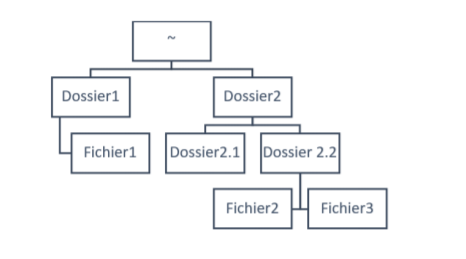

#TP1 AZZOUZ KARA
##Exercice 2 : Prise en main de l'interpréteur de commande
####Manuel
1. La commande which permet de trouver le fullpath d'un dossier/fichier 
2. On écrit (une fois en lecture du manuel) "/" + "keyword" (ex: ```/fichier``` pour trouver "fichier" dans le man)
3. On quitte le manuel avec la touche q
4. On y accède avec la commande ```man 6 intro```

####Navigation dans l'arborescence des fichiers
1. ```cd var/log```
2. ```cd ..```
3. ```cd ~```
4. ```cd -```
5. Affichage de l'ouput du terminal :
    ```
    ~$ cd /root
    Permission non accordée
    ``` 
6. Affichage de l'ouput :
    ```
    ~$ sudo cd /root
    Commande introuvable
    ``` 
7. Arborescence 
    ```
    cd ~
    mkdir Dossier1
    touch Dossier1/fichier1
    mkdir Dossier2 Dossier2/Dossier2.1 Dossier2/Dossier2.2
    touch Dossier2/Dossier2.2/fichier2 Dossier2/Dossier2.2/fichier3 
    ``` 
8. Commandes utilisée pour supprimer Fichier 1 (depuis ~/):
    ```
    rm Dossier1/fichier1
    rm -r Dossier1
    ```

9. ```rm -r <nom_dossier>```

10. Cela supprime Dossier2 et ses enfants

11. ```rm -r Dossier2``` 
    > rm -rf Dossier2 pour le supprimer sans que le terminal ne demande de confirmation ou autres

####Commandes important

1.  
    * ```date +"%H:%M"``` 
    * ```time <commande>``` permet d'évaluer le temps d'exécution d'une commande

2.  
    ```ls``` permet d'afficher les dossier et fichier du dossier courant  
    ```la``` est une abréviation de ```ls -a``` qui affiche les dossier et fichiers cachés (.bash_profile par exemple)

3. Affichage output
    ```
    ~$ which ls
    usr/bin/ls
    ```

4. ```ll``` est l'alias de ```ls -alF```

5. ```ls /bin```

6. ```ls ..``` affiche les dossiers/fichiers à la racine du dossier parent

7. ```pwd``` donne le chemin complet du dossier courant

8. ```echo 'yo' > plop``` crée le fichier ```plop``` s'il n'existe pas et écrit dans plop 'yo'. À la seconde exécution 'yo' est écrasé dans le fichier ```plop``` et 'yo' est à nouveua réécrit

9. ```echo 'yo' >> plop``` exécuté 2 fois écrit deux 'yo' dans ```plop``` à la suite

10. ```file <nom_fichier>``` trouve le type du fichier et quelques caractéristiques (ex: taille pour une image)

11. Quand on modifie ```toto```, ```titi``` est aussi modfié.  
    Pour la suppression, ```toto``` est supprimé et ```titi``` n'a aucune modification

12. Quand on modifie ```titi```, ```tutu``` est aussi modfié.  
    Quand on supprime ```titi```, ```tutu``` existe physiquement, mais il n'est plus consultable

13. ```CTRL+S``` pour stopper le défilement  
    ```CTRL+Q``` pour le reprendre

14.  ```head -n 5 /var/log/syslog``` pour afficher les 5 premières  
    ```tail -n 15 /var/log/syslog``` pour les 15 dernière  
    ```head -n 20 /var/log/syslog | tail -n 11```

15. ```dmesg | less``` affiche les messages du kernel page par page

16. Contient des informations sur les utilisateurs.  Command pour l'afficher : ```man /etc/passwd```

17. ```cat /etc/passwd | cut -d":" -f 1 | sort```

18. ```cat /etc/passwd | wc -l``` (compte le nombre de ligne de ```/etc/passwd``` car 1 ligne = 1 user)

19. ```man -k conversion | wc -l``` &rarr; 45

20. ```sudo find / -name passwd```

21. ```sudo find / -name passwd > ~/list_passwd > ~/list_passwd.txt 2>/dev/null```

22. 

23. Pour localiser ```history.log``` :  
    ```
    locate history.log 
    /var/log/apt/history.log
    ```
24. ```locate fichier``` ne trouve pas le fichier nouvellement créé car on n'a pas fait de ```sudo updatedb``` pour réindexer tous les fichiers

##Exercice 3 : Découverte de l'éditeur nano

1. *rien à faire*

2. ```CTRL+\ ``` pour le raccourci "remplacer" et entrer les mots correspondants
3. 
4 et 5. ```CTRL+X``` pour quitter *(si il y a des modifs, nano propose d'enregistrer ou non)*

##Exercice 4 : Personnalisation du shell

3 et 4. ```PS1='\[\033[35m\][\A]-${debian_chroot:+($debian_chroot)}\[\033[01;32m\]\u@\h\[\033[00m\]:\[\033[36m\]\w\[\033[00m\]\$ '```